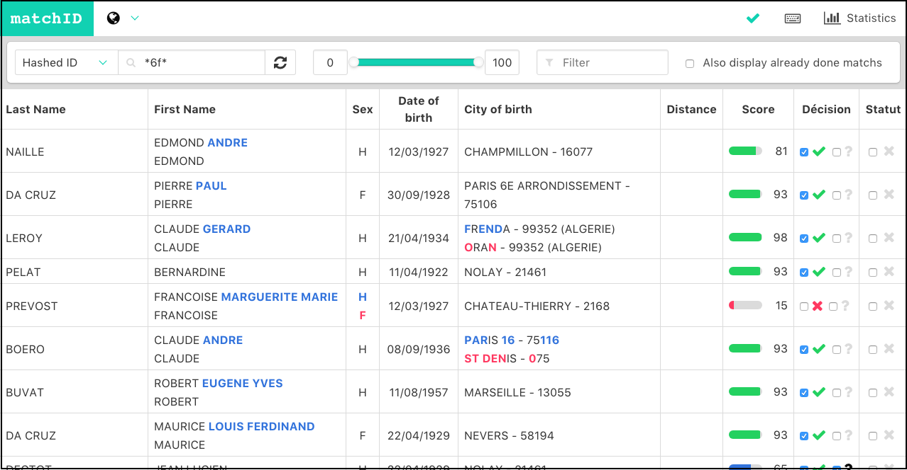

This repository is part of a wider project called *matchID* (to be fully released soon).

### :squirrel: about *matchID* :squirrel:

 *matchID* aims at helping developers (and organizations) to match people's identities, a kind of [dedupe library](https://github.com/dedupeio/dedupe) but focused mainly on people.

Two main applications :
- **link a database** filled with people informations **to another database** also filled with people informations
- **remove duplicate people** from a database

> *matchID* is developed by [@rhanka](https://github.com/rhanka) and [@SuperKiwi](https://github.com/SuperKiwi) who is part of the ["Entrepreneur d'Intérêt Général" 2017 program](https://www.etalab.gouv.fr/entrepreneurs-dinteret-general), a French presidential program aiming to bring tech people into working for an administration for a 10 month period — inspired by Obama's [Presidential Innovation Fellows (PIF)](https://pif.gov/).

# *matchID validation*

The goal of this repository (the *validation* sub-project) is to provide an user-friendly interface to display matching results of *matchID-backend* (to be released soon).

**It allows users to easily visualize matchs between people.**

Main used technologies are **VueJs** and **ElasticSearch**.
> An **elasticsearch instance running is mandatory** to make this application work



------

------

## Contents

* [Quick Tour](#quick-tour)
  * [Navbar](#navbar)
  * [Controller](#controller)
  * [Data Table](#data-table)
* [Installation](#installation)
  * [Requirements](#requirements)
  * [Elastichsearch](#elasticsearch)
  * [Repository](#repository)
* [Configuration](#configuration)
  * [Elasticsearch settings](#elasticsearch-settings)
  * [Columns](#columns)
  * [Custom functions](#custom-functions)
  * [Custom style](#custom-style)
  * [Validation](#validation)
  * [Scores](#scores)
  * [Random Hash](#random-hash)
  * [Localization](#localization)
* [Keyboard shortcuts](#keyboard-shortcuts)

------

------

## Quick tour

### Navbar


**There are four different parts in the navbar:**

-  *Change the language of your app*

-  /  *Green check or Red cross if connection to Elasticsearch is working*

-  *Keyboard shortcuts cheatsheet*

-  *Statistics on processed matchs*

------

### Table Controller


**There are also four parts in the controller :**

-  *Query we are sending to Elasticsearch*

-  *Range filter if you have a score column on your datasets*

-  *Filter through results from Elasticsearch with text filtering*

-  *Filter through results from Elasticsearch depending on the fact that a match has been already processed or not*

------

### Data Table


> Please note that all data displayed here is dummy randomized data

The data table lists all different matchs found by *matchID backend*. Except the two columns *Results* and *Status*, all other **columns can be customized**.

> #### Generally speaking, many things can be customized to your needs in *matchID validation*

- *Results* column are pre-computed results according to the score (displayed in the previous column). In this example:
  - if the *score* is above 55, the first checkbox (`validation_decision`) will be set to `true`
  - if the *score* is between 40 and 65, the question mark checkbox (`validation_indecision`) will be set to `true`
- *Status* column is checked to true once you consider that the results (`validation_decision` and `validation_indecision`) are correct

------

------

## Installation

### Requirements

- a recent version of `node`
- a recent version of `npm` or `yarn`
- a recent version (> `5.x`) version of `elasticsearch`

### Elasticsearch

To install and configure elasticsearch on your server or localhost, please follow [official guidelines](https://www.elastic.co/guide/en/elasticsearch/reference/current/_installation.html)

> Note sure about the minimum required version of `elasticsearch` which is needed. We used `5.x` versions to develop *matchID*

Your data mapping needs to 
```json
{
  "data_mapping": "settings"
}
```

### Repository

```shell
git clone https://github.com/eig-2017/matchID-validation.git
cd matchID-validation
yarn -OR- npm install
```

And once, your [configuration](#configuration) has been set, use `yarn run dev` (or `npm run dev`)


------

------

## Configuration

------

------

### Elasticsearch

------

### Columns

------

### Custom functions

------

### Custom style

------

### Validation

------

### Scores

------

### Random Hash

------

### Localization

------

------

## Keyboard Shortcuts

`Ctrl`+ `Alt` will enable/disable the shortcuts.

Once enabled, the following ones are available :
- `a` will change the pre-computed decision (`validation_decision`)
- `e` will change the pre-computed indecision (`validation_indecision`)
- `Arrow UP` and `Arrow DOWN` allow you to move between rows
